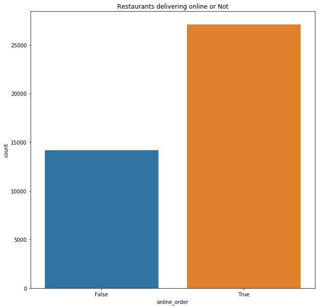

# Zomato_data_EDA

Cleaned, analysed messy data and created a predictive model with and accuracy of 93% with tree Regressor algorithm

# Problem Statement

The basic idea is analyzing the Buisness Problem of Zomato  to get a fair idea about the factors affecting the establishment of different types of restaurant at different places in Bengaluru, aggregate rating of each restaurant and many more. I have provided the link to download the dataset at the end of this notebook.

# Approach

1. **Loading the dataset:** Load the data and import the libraries.  
2. **Data Cleaning:**  
 - Deleting redundant columns.
 - Renaming the columns.
 - Dropping duplicates.
 - Cleaning individual columns.
 - Remove the NaN values from the dataset
 - #Some Transformations
3. **Regression Analysis**
 - Linear Regression
 - Decision Tree Regression
 - Random Forest Regression
4. **Data Visualization:** Using plots to find relations between the features.
 - Restaurants delivering Online or not
 - Restaurants allowing table booking or not
 - Table booking Rate vs Rate
 - Best Location
 - Relation between Location and Rating
 - Restaurant Type
 - Gaussian Rest type and Rating
 - Types of Services
 - Relation between Type and Rating
 - Cost of Restuarant
 - No. of restaurants in a Location
 - Restaurant type
 - Most famous restaurant chains in Bengaluru 

# Results

## Restaurants delivering Online or not

Most of restraunts deliver online which is good thing as a big chunk of revenue is collected from delivery from online platforms.

## Table booking Rate vs Normal Rate

.png)

We can observe from the plots the high amount of rating to restaurants where the booking was done.

## Location wise count of Restaurants

.png)

.png)

This gives a clear idea about the places with hav high amount of restraunts this can be because this placeses can be among the placeses  must be mor epopular for food and hangout placeses for people.
Some placeses which have high density of restraunts are:
* BTM.
* Jayanagar.
* Koramangal 4th, 5th, 6th and 7th block.

## Location wise ratings of Restraunts

.png)

This plots shows the rating of customers given to restraunts in that particular locations. This can give a good idea about from which locations customers prefer to get food from and which are popular among customers.

## Count of Restaurants types

.png)

.png)

This shoqs what types of restaurants are more. This can also be due to people are more likely to eat food from these types of restraunts.
Some famous types are:
* Casual Dinings
* Quick Bites
* Cafes

## Rating with respect to restaurant types

.png)

This gives a clear idea about what types of restaurants are most liked by the customers.

## Types of Services

.png)

This plot gives a clear how delivery and dine out services are more prefered by the customers.

## Cost of restaurants

.png)

This shows that more restraunts fall in the price category of 250-700 which is qquite normal and common.

## Most famous Restaurant chains in Bengaluru

